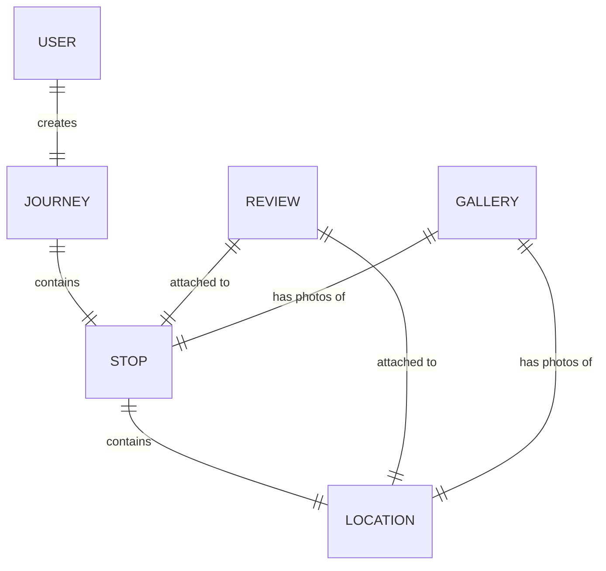

# tripscribe
Repository for the travel app Tripscribe

## Introduction
TripScribe is a website designed to allow users to create, document and share journeys they have been on in their life. Users are able to create "Journeys" in their profile, attach dates to the cities they visit, add in places they visited while there, then attach photos and reviews. These journeys can then be shared with friends, who can see these journeys. 

## Who is this for?
The goal of this website is for people who are interested in traveling and documenting where they have been, both to share their experiences and keep a journal about their journeys. This idea came about originally as a replacement for a physical travel log - something I had used during a trip across America.

## How will this be used?
The user will create an account on the website and gain access to a dashboard from which they can create new journeys and edit already created journeys. Within a journey they can detail the major stops they visited and attractions/restaurants they went to while there, creating a review for each as well as attaching pictures. Journeys will be collected in a dashboard for easy viewing/editing. Account creation should only require basic information about the user.

### Create Journey
- User clicks "Create Journey" in the dashboard
- User enteres a name for the journey
- User redirected to the Journey edit page

### View/Edit Journey
- From dashboard, user selects one of their created journeys to be redirected to it
- User is shown information attached to that journey (Stops, Places Visited, Photos, etc.)
- User can click an "Edit Journey" button which allows them to add new details or edit existing one (When first redirected here, editing will be enabled)

### Add Stop 
- Once a journey is in edit mode, the user can add stops that they have visited, with a stop being a city, national park, event, etc.
- User enters the name of the stop, the date arrived, and the date of departure

### Add Location
- With a stop created, the user can add a location they visited within that stop, including name and brief description (Restaurant, Museum, etc.) 

### Add Photographies and Reviews
- Both the stop in general as well as individual locations can be given a review or attached photographs
- For a review, the user writes what they want posted and when complete it will appear in that journey along the attached stop
- For photographs, the other uploads photographs from their local file storage/drag and drop function 

These are the basic functions that the user should be able to accomplish. Once a journey has been created, the details of it should be able to be seen in the dashboard - for example showing the number of visited stops and range of dates that the journey took place on. When the user goes from the dashboard into a journey, they will find the stops listed in chronological order with attached reviews and photos in a "gallery". 

Furthermore once a user has created a journey, they should be able to share it using a link to their friends. With this link, the user should be able to see the same page but without the ability to edit the page.

## Dictionary 
- **User**, a person who is interacting with the website, they have to own an account on the website to access the features
- **Journey**, a journey is created from a user's dashboard and represents a vacation of any length, from one major city to a tour of a few difference places
- **Stop**, a stop represents a city or a major destination within the journey and has the dates of when the user arrived and departed
- **Location**, a location is used to break up the major stop into smaller pieces, for examples restaurants and museums within a city or viewpoints in a national park
- **Review**, a text review of the user's thoughts which can be attached to both a stop or location
- **Gallery**, a collection of photos that are attached to a stop or location

## MVP
- User account Creation
- Journey Creation
- Adding City to the Journey
- Adding Locations to City
- Attach review to city and location
- Add photos to city and location
- User can share a journey with someone else (Being a user not required maybe)

## Stretch Goals 1 - Basic Social Media
- Social media aspect allowing users to add others to a friend's list from where they can see all their trips
- Privacy settings for journeys (private, friend's only, public)
- Allow users to search and find public journeys from other user's using the name of a stop or location

## Stretch Goals 2 - Planner Feature
- Allow user's to create journeys in advance instead of just in the past
- Invite other user's who will be joining them 
- They can organise a timetable for their travel plans and use public reviews to decide to add certain places to their plans

## Stretch Goals 3 - Mapper Feature
- Add a world map to the user's dashboard
- Populate the map with a number of 'pins' that represent places from their journeys
- Clicking a pin will select that journey as if they selected it from the list

### Misc. Links
Trello - https://trello.com/b/G33esPU4/tripscribe-kanban
Lucidchart Database ERD - https://lucid.app/lucidchart/836838f8-d65a-44f7-8172-ce222fe9e87c/edit?viewport_loc=-1376%2C-334%2C3491%2C1760%2CLaP3wGvsL-Vc&invitationId=inv_b329b385-764e-4ddc-9f05-c24404f51496
